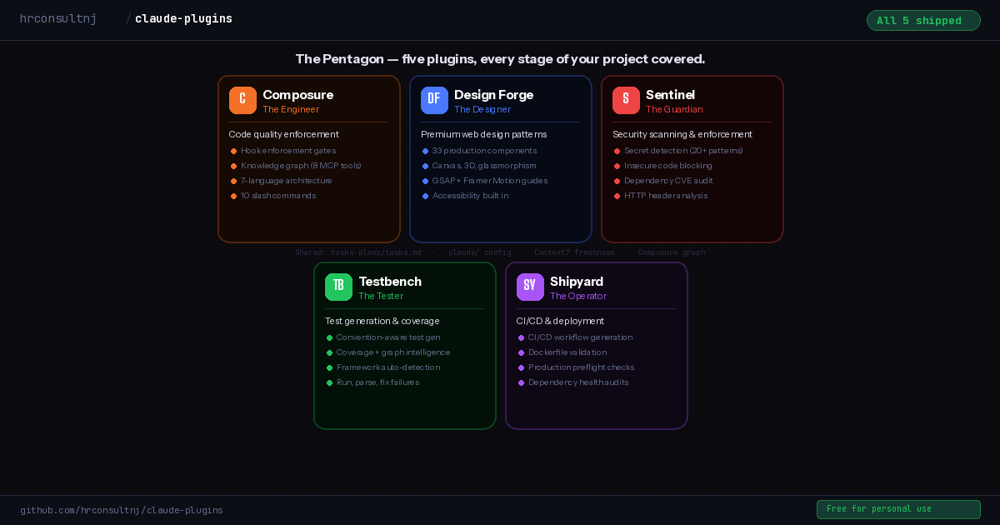
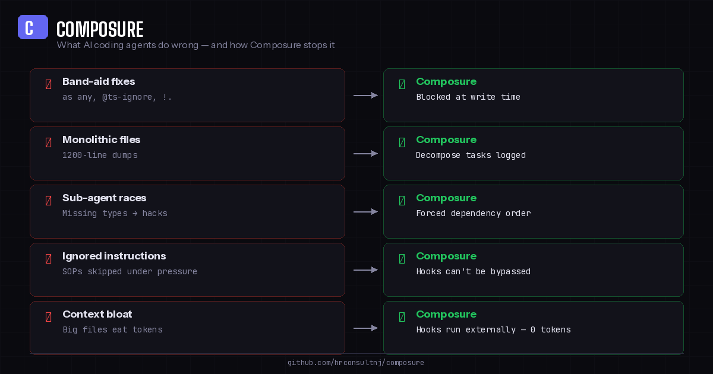
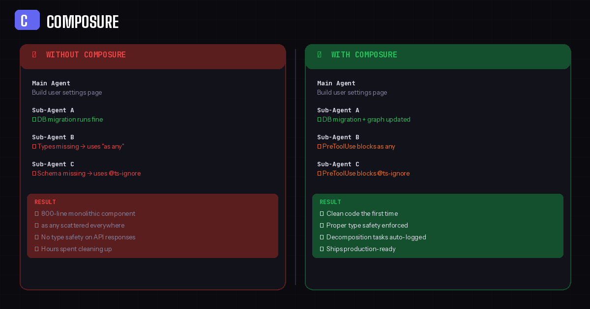
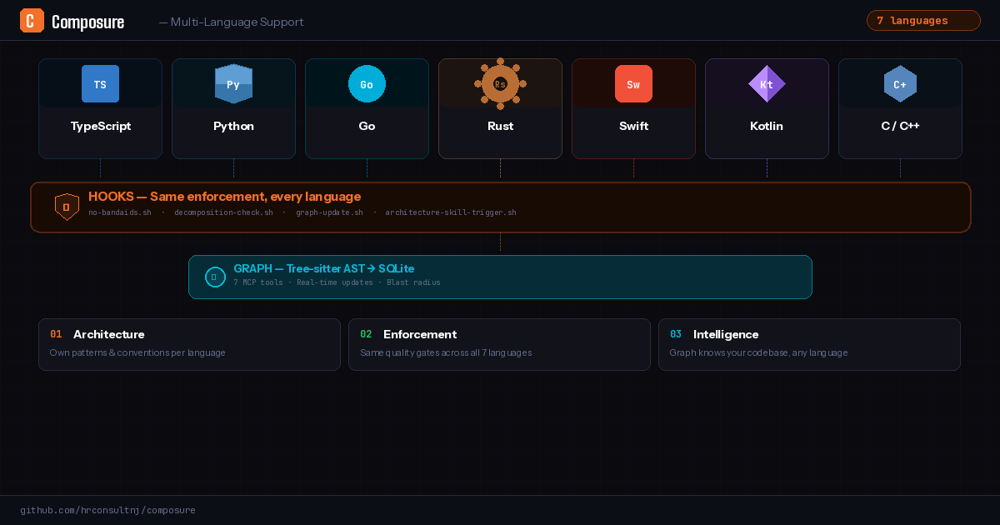
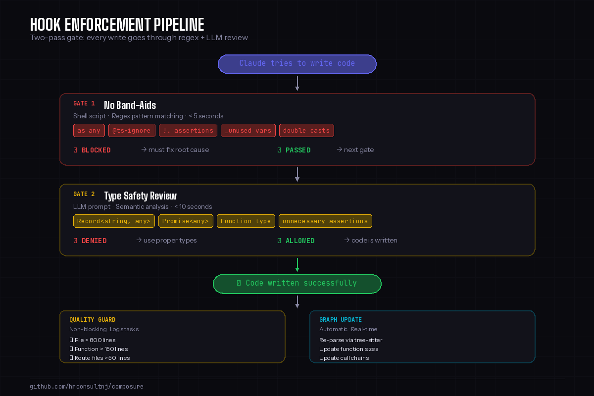
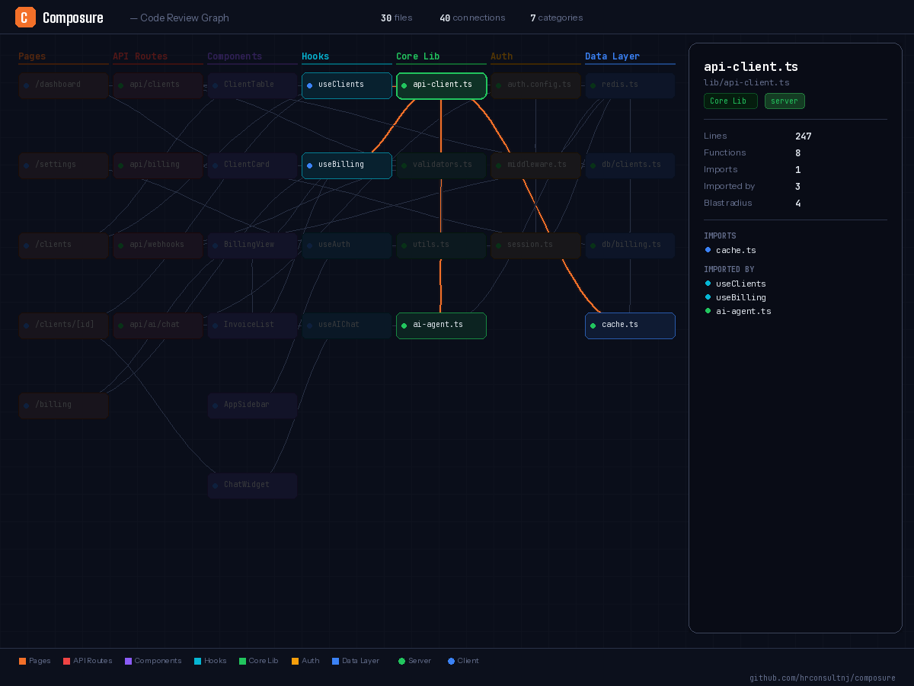

# Claude Code Plugins

Claude writes code fast. These plugins make sure it writes it right.

> 5 plugins &middot; 29 skills &middot; 20 automated hooks &middot; 7 languages &middot; One command setup

<p align="center">
  
</p>

## The Problem

AI coding agents are fast — but speed without guardrails creates expensive cleanup work. If you've used Claude Code on a real project, you've seen this:

- **Band-aid fixes** — `as any`, `@ts-ignore`, non-null assertions to silence errors instead of fixing types
- **Monolithic files** — 800+ line components that no one wants to touch later
- **Sub-agent races** — parallel agents skip shared types and hack around missing schemas
- **Ignored instructions** — CLAUDE.md says "use proper types" but under pressure, the agent takes shortcuts
- **No test coverage** — features ship without tests, coverage erodes silently
- **Insecure patterns** — hardcoded secrets, `eval()`, SQL injection vectors slip through unnoticed

You can write better prompts. You can add more rules to CLAUDE.md. But the agent can still ignore all of it — instructions are suggestions, not enforcement.

**Hooks are different.** They run as shell scripts on every Read/Edit/Write — outside the LLM, at zero token cost. The agent literally cannot bypass them. That's how these plugins work.

<p align="center">
  
</p>

<p align="center">
  
</p>

## What You Get (Free)

All plugins, all skills, all hooks — free for personal use, education, and nonprofits.

| What | Count | Details |
|------|-------|---------|
| Plugins | 5 | Composure, Design Forge, Sentinel, Testbench, Shipyard |
| Skills | 27 | Architecture, security scanning, test generation, CI/CD, audits |
| Hooks | 19 | Code quality, secret detection, type safety, CI validation |
| Reference docs | 23 | Security patterns, testing patterns, deployment guides |
| Templates | 12 | Test files, GH Actions workflows, Dockerfiles |
| Languages | 7 | TypeScript, Python, Go, Rust, C++, Swift, Kotlin |

<p align="center">
  
</p>

## Plugins

| Plugin | What it solves |
|--------|---------------|
| **[Composure](plugins/composure/)** | Code quality enforcement — decomposition hooks, architecture skills, code review knowledge graph, severity-tracked task queue. The foundation that all other plugins build on. |
| **[Sentinel](plugins/sentinel/)** | Security scanning — SAST, secret detection on every write, dependency CVE audit, HTTP header analysis. Local-first, no cloud auth. |
| **[Testbench](plugins/testbench/)** | Convention-aware test generation — reads your existing tests to match project style. Nudges when you edit untested files. |
| **[Shipyard](plugins/shipyard/)** | CI/CD generation and validation — GitHub Actions, GitLab CI, Bitbucket Pipelines. Dockerfile validation, dependency health, production readiness. |
| **[Composure Pro](https://buymeacoffee.com/hrconsultnj/e/524085)** | 22 production architecture patterns + schema guard hook. Postgres RLS, tenant isolation, entity registry, auth model, type generation — battle-tested across 322+ migrations. Works with any Postgres host. |
| **[Design Forge](plugins/design-forge/)** | Premium web design patterns — 33 production components, canvas presets, animation recipes, 3D integration, accessibility-first. |

## Installation

You only need one install command. Composure is the foundation — when you run `/composure:initialize`, it detects your stack and automatically installs the companion plugins (Sentinel, Testbench, Shipyard).

```bash
# Add the marketplace
claude plugin marketplace add hrconsultnj/claude-plugins

# Install Composure
claude plugin install composure@my-claude-plugins

# Initialize in your project (auto-installs companion plugins)
/composure:initialize
```

Design Forge is the one optional install — add it if you're building frontend experiences:

```bash
claude plugin install design-forge@my-claude-plugins
```

## How It Works

Composure operates at three layers — each one doing a different job:

<p align="center">
  
</p>

**Hooks (The Enforcer)** — Shell scripts that fire on every Read, Edit, and Write. Two-pass gate: regex pattern matching blocks `as any`, `@ts-ignore`, and other band-aids in under 5 seconds. Then a semantic type-safety review catches `Record<string, any>`, `Promise<any>`, and unnecessary assertions. The agent cannot bypass hooks — they run outside the LLM at zero token cost.

**Skills (The Playbook)** — 27 slash commands covering architecture (`/composure:app-architecture`), security scanning (`/sentinel:scan`), test generation (`/testbench:generate`), CI/CD (`/shipyard:ci-generate`), and more. Each skill loads framework-specific reference docs so Claude builds features using current API patterns, not stale training data.

**Graph (The Brain)** — A tree-sitter AST parser that builds a SQLite knowledge graph of your codebase. Functions, imports, call chains, file sizes — all queryable through 7 MCP tools. When you run `/composure:review-pr`, Claude knows the blast radius of every change. When you edit a file, the graph updates automatically.

<p align="center">
  
</p>

<details>
<summary><strong>How the plugins connect</strong></summary>

```
Composure (foundation)
  ├── .claude/no-bandaids.json      ← All plugins read this for stack detection
  ├── tasks-plans/tasks.md          ← All plugins write findings here
  ├── /composure:commit             ← Blocks on Critical findings from ANY plugin
  └── composure-graph MCP           ← Testbench uses for coverage intelligence

Sentinel (security layer)
  ├── secret-guard.sh               ← Blocks exposed secrets on every Edit/Write
  ├── insecure-pattern-guard.sh     ← Blocks insecure code patterns (22 patterns, 4 languages)
  └── /sentinel:scan                ← Full SAST + dependency audit → tasks-plans/

Testbench (testing layer)
  ├── test-coverage-nudge.sh        ← Nudges when editing untested files (session-deduped)
  ├── /testbench:generate           ← Convention-aware test generation
  └── /testbench:run                ← Run tests, parse failures with source context

Shipyard (deployment layer)
  ├── ci-syntax-guard.sh            ← Validates CI config on every edit
  ├── dockerfile-guard.sh           ← Warns on Docker anti-patterns
  ├── /shipyard:ci-generate         ← Generate CI workflow from detected stack
  └── /shipyard:preflight           ← Production readiness checklist

Design Forge (design layer)
  └── /design-forge                 ← Premium components adapted to your stack
```

</details>

<details>
<summary><strong>All skills reference</strong></summary>

### Composure

```
/composure:initialize            # Detect stack, build graph, generate config
/composure:app-architecture      # Feature-building guide — framework-specific refs
/composure:commit                # Commit with auto task queue hygiene + graph update
/composure:decomposition-audit   # Full codebase scan for size violations + ghost duplicates
/composure:review-tasks          # Process task queue (verify, delegate, archive)
/composure:review-pr             # PR review with blast-radius analysis
/composure:review-delta          # Review changes since last commit
/composure:build-graph           # Build/update code review knowledge graph
/composure:code-organizer        # Restructure project layout to framework conventions
/composure:update-project        # Refresh config, hooks, or docs without full re-init
```

### Sentinel

```
/sentinel:initialize             # Detect stack, install security tools, generate config
/sentinel:scan                   # Full SAST (Semgrep) + dependency audit
/sentinel:audit-deps             # Focused dependency vulnerability scan
/sentinel:headers                # HTTP security header analysis (context-aware grading)
```

Sentinel also runs automatically via hooks:
- **secret-guard** — blocks exposed secrets on every Edit/Write (19 patterns: AWS, GitHub, Stripe, SSH keys, JWTs, Supabase service_role, and more)
- **insecure-pattern-guard** — blocks insecure code patterns (eval, innerHTML, SQL injection, command injection across TypeScript, Python, Go, Rust)
- **dep-freshness-check** — checks for known CVEs on session start

### Testbench

```
/testbench:initialize            # Detect test framework, learn project conventions
/testbench:generate <file>       # Generate tests matching your project style
/testbench:run [all|changed]     # Run tests, parse failures with source context
```

### Shipyard

```
/shipyard:initialize             # Detect CI platform, deployment target, tools
/shipyard:ci-generate            # Generate CI workflow (GH Actions, GitLab, Bitbucket)
/shipyard:ci-validate            # Validate existing CI workflows (12 checks + actionlint)
/shipyard:deps-check             # Dependency health — CVEs, safe version recommendations
/shipyard:dockerfile             # Generate/validate multi-stage Dockerfiles
/shipyard:preflight              # Production readiness checklist
```

### Design Forge

```
/design-forge                    # Browse and apply premium web design patterns
/ux-researcher                   # Research design patterns and competitors
```

</details>

## Composure Pro ($39)

The free plugins catch mistakes as they happen — band-aids blocked, secrets caught, decomposition violations logged. But catching mistakes is reactive. **Pro makes Claude proactive.**

Pro adds **22 production architecture patterns** and a **schema guard hook** — the kind of knowledge you build after shipping 9+ multi-tenant apps across 322+ migrations. These aren't tutorials. They're reference patterns that Claude reads and applies directly when building features, plus a PreToolUse hook that blocks SQL anti-patterns before they land.

**The difference:** Without Pro, Claude builds the feature and the hooks catch what went wrong. With Pro, Claude builds it correctly from the start — proper tenant isolation, layered access control, migration-safe RLS policies, trigger-driven denormalization — because it has the architectural knowledge before writing the first line, and the schema guard blocks mistakes the agent would otherwise make.

| Category | Docs | What Claude Learns |
|----------|------|-------------------|
| Bootstrap | 1 | Foundation migration sequence — enum catalog, function authority, dependency order |
| DB Foundation | 5 | Entity registry, ID prefixes, 4-level auth, privacy roles, contact-first linking |
| Conventions | 1 | JSONB metadata naming, entity.relationship templates |
| Infrastructure | 3 | Google Places → trigger → PostGIS pipeline, trigger-driven denormalization, DB-to-TypeScript type generation |
| Optional Modules | 3 | Device registry + sessions, unified inbox/threads/messages, OAuth token storage |
| RLS Policies | 5 | Row-level security patterns, role hierarchy, migration checklist (90+ items), common pitfalls |
| Frontend | 4 | Query key factories, component patterns, three-tier loading system, multi-tenant OrgSwitcher with tenant filtering |

Plus a **schema guard hook** that blocks: boolean status columns, inline role definitions, missing tenant columns, missing RLS, and computed privacy groups — citing the exact pattern doc in each violation message.

When you combine free + Pro, this is what changes: anytime you need to build something that touches the database, the agent builds it properly — pages, components, migrations, permissions — without you having to go back, babysit, and re-read documentation that was clearly defined but got skipped for speed.

**[Get Composure Pro ($39)](https://buymeacoffee.com/hrconsultnj/e/524085)** — one-time per major version. Existing customers get 50% off upgrades.

## Troubleshooting

<details>
<summary><strong>Reinstall a plugin</strong></summary>

```bash
# Uninstall
claude plugin uninstall composure
# Reinstall
claude plugin install composure@my-claude-plugins
# Restart Claude Code (exit and reopen)
```

</details>

<details>
<summary><strong>Code review graph not working</strong></summary>

Composure's code graph requires **Node.js 22.5+**. Check with `node --version`.

If Node is fine but the graph still doesn't work, run `/composure:initialize` — it will auto-register the server and survive future plugin updates.

Or register manually:

```bash
# Find your plugin path
COMPOSURE_PATH=$(claude plugin list --json | node -e "
  const p = JSON.parse(require('fs').readFileSync('/dev/stdin','utf8'));
  const c = p.find(x => x.id.startsWith('composure') && x.enabled);
  if (c) console.log(c.installPath);
")

# Copy launcher to stable location + register
cp "$COMPOSURE_PATH/scripts/launch-graph-server.sh" ~/.claude/plugins/composure-graph-launcher.sh
chmod +x ~/.claude/plugins/composure-graph-launcher.sh
claude mcp add composure-graph -- bash ~/.claude/plugins/composure-graph-launcher.sh

# Restart Claude Code
```

</details>

<details>
<summary><strong>Graph stops working after plugin update</strong></summary>

After `claude plugin update composure`, just restart Claude Code (Ctrl+C → `claude`). The launcher resolves the latest cached version at startup — no re-registration needed.

</details>

<details>
<summary><strong>Remove everything (full reset)</strong></summary>

```bash
# Remove plugins
claude plugin uninstall composure
claude plugin uninstall design-forge
claude plugin uninstall sentinel
claude plugin uninstall testbench
claude plugin uninstall shipyard

# Remove the MCP server (if registered)
claude mcp remove composure-graph

# Remove the marketplace
claude plugin marketplace remove my-claude-plugins
```

</details>

## Licensing

All plugins are [PolyForm Noncommercial 1.0.0](https://polyformproject.org/licenses/noncommercial/1.0.0/).

| Tier | Price | What you get |
|------|-------|-------------|
| **Free** | $0 | All 5 plugins, 29 skills, 20 hooks — personal use, education, nonprofits |
| **Composure Pro** | [$39](https://buymeacoffee.com/hrconsultnj/e/524085) | 22 architecture patterns + schema guard hook — for individual developers |
| **Commercial License** | [$99](https://buymeacoffee.com/hrconsultnj/e/524265) | All plugins for commercial use + includes Pro patterns — one-time, per major version |

One-time purchase. Most AI code review tools charge $20-30/seat/month — this is a flat fee for your entire team, forever.

**[Get Pro ($39)](https://buymeacoffee.com/hrconsultnj/e/524085)** &middot; **[Get Commercial ($99)](https://buymeacoffee.com/hrconsultnj/e/524265)** &middot; Existing customers get 50% off upgrades

## Support

If these plugins save you time, consider supporting the project:

<a href="https://buymeacoffee.com/hrconsultnj" target="_blank"></a>

[buymeacoffee.com/hrconsultnj](https://buymeacoffee.com/hrconsultnj)
