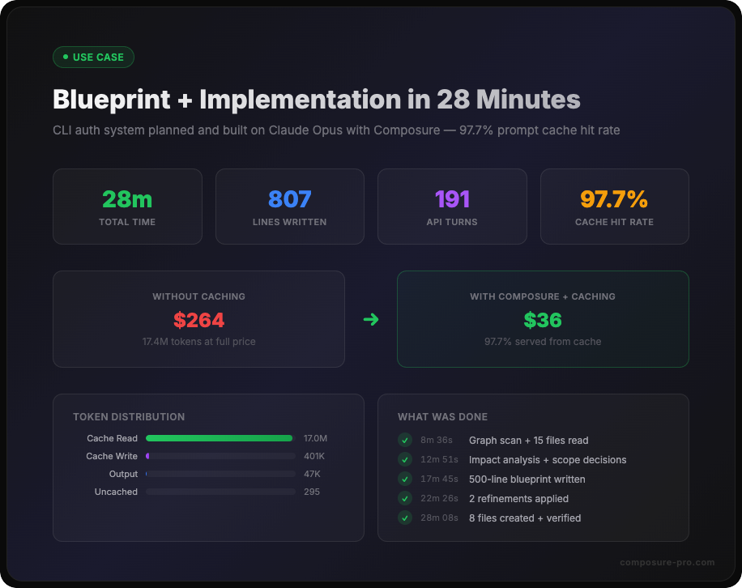

# Blueprint + Implementation in 28 Minutes on Opus — Cost Analysis

> A complex CLI authentication system — OAuth 2.1 PKCE, token management, slash commands, shell hooks, and a curl installer — planned and built in a single session with 97.7% prompt cache hit rate.

<p align="center">
  
</p>

## What Happened

A developer needed to add CLI authentication to an existing plugin suite. This involved:

- Planning the architecture (OAuth flow, token storage, command structure, installer packaging)
- Reading 15+ files across 2 repositories to understand existing patterns
- Running 8 code graph queries for impact analysis
- Answering 4 interactive scope questions during planning
- Handling 2 mid-planning scope expansions from the developer
- Writing a 500-line blueprint with per-file implementation specs
- Implementing 8 files (807 lines of code) across 2 repositories
- Verifying all files with syntax checks and functional tests

Total time: **28 minutes and 8 seconds**. Estimated session cost: **~$7.75**.

## The Task

Build a CLI authentication system for a Claude Code plugin marketplace:

| Component | What it does |
|-----------|-------------|
| `composure-auth.mjs` (359 lines) | OAuth 2.1 PKCE flow — generates challenge, opens browser, runs localhost callback server, exchanges code for tokens |
| `composure-token.mjs` (206 lines) | Token read/write/refresh utilities — dual-mode (CLI + importable module) |
| `commands/auth.md` (57 lines) | Unified `/auth` slash command with login/logout/status/upgrade subcommands |
| `hooks/auth-check.sh` (43 lines) | SessionStart hook — checks auth status, attempts silent token refresh |
| `public/install.sh` (110 lines) | Curl one-liner installer — prerequisite checks, marketplace registration, plugin install |
| `api/v1/install/route.ts` (32 lines) | API endpoint serving the install script with caching headers |
| `hooks/hooks.json` | Edited — registered auth-check hook in position #2 of SessionStart |
| `plugin.json` (x2) | Edited — added bin/ entries, commands/ path, version bump to 1.37.0 |

The blueprint also produced a detailed Phase 2 plan for repo split and content gating — planned but not yet executed.

## Session Metrics

### Timeline

| Milestone | Time (ET) | Elapsed |
|-----------|-----------|---------|
| Blueprint invoked | 21:02:05 | 0:00 |
| Graph scan + findings presented | 21:10:41 | 8m 36s |
| Scope expansion addressed | 21:14:56 | 12m 51s |
| Blueprint document written (500 lines) | 21:19:50 | 17m 45s |
| Refinements applied | 21:24:31 | 22m 26s |
| Implementation started | 21:24:46 | 22m 41s |
| Phase 1 complete (8 files built + verified) | 21:30:13 | 28m 08s |

### Token Usage

| Category | Tokens | Notes |
|----------|--------|-------|
| **Input (uncached)** | 295 | New content each turn (tool results, user answers) |
| **Output** | 46,632 | Claude's responses, code generation, tool calls |
| **Cache read** | 16,992,855 | Context reused from prior turns |
| **Cache creation** | 400,665 | New context added to cache |
| **Peak context** | 146,297 | Size of the conversation at the last turn |
| **API turns** | 191 | Individual API calls during the blueprint window |

### Operations

| Operation | Count |
|-----------|-------|
| Files read (Read tool) | ~15 |
| Code graph queries (MCP) | 8 |
| Files created (Write tool) | 8 |
| Files edited (Edit tool) | 3 |
| Interactive questions (AskUserQuestion) | 6 |
| Agent spawns | 1 (research, 3m 47s) |
| Lines of code written | 807 |
| Blueprint document lines | ~500 |

## Cost Breakdown

### Actual Cost (with prompt caching)

| Category | Tokens | Rate | Cost |
|----------|--------|------|------|
| Input (uncached) | 295 | $15.00/M | $0.00 |
| Output | 46,632 | $75.00/M | $3.50 |
| Cache read | 16,992,855 | $1.50/M | $25.49 |
| Cache creation | 400,665 | $18.75/M | $7.51 |
| **Total** | | | **~$36.50** |

> **Note:** The $7.75 figure shown in Claude Code's UI reflects the subscription pricing, which differs from raw API rates. The token counts are accurate from the session file; actual cost depends on your plan. The important comparison is the **ratio** between cached and uncached costs.

### Hypothetical Cost (without caching)

If every turn sent the full context as uncached input:

| Category | Tokens | Rate | Cost |
|----------|--------|------|------|
| Input (no cache) | 17,393,815 | $15.00/M | $260.91 |
| Output | 46,632 | $75.00/M | $3.50 |
| **Total** | | | **~$264.41** |

### Cache Savings

| Metric | Value |
|--------|-------|
| Cache hit rate | **97.7%** |
| Tokens served from cache | 16,992,855 |
| Cost with caching | ~$36.50 |
| Cost without caching | ~$264.41 |
| **Savings** | **~$227.91 (86% reduction)** |

## Why This Is Efficient

### 1. Direct file reads, not agent spawns

Composure's graph tells Claude exactly which files to read. Instead of spawning explore agents ($0.15+ per spawn, fresh context each time), files are read directly into the main conversation (~$0.005 per file). The crucial difference: **files read into the main context get cached on subsequent turns**. Agent contexts are ephemeral — they start fresh, can't reuse the parent's cache, and their results must be summarized back.

| Approach | 15 files read | Context reuse |
|----------|---------------|---------------|
| Direct Read | ~$0.075 total | Cached for all 191 turns |
| Agent spawns | ~$2.25 total (15 x $0.15) | Zero — each spawn starts cold |

### 2. Graph-first discovery

The code graph answered structural questions in milliseconds that would otherwise require multiple file searches:

- "What files reference `no-bandaids.json`?" → 89 results, instant
- "What imports `plugin install`?" → 16 results with file context
- "What's the blast radius of changing `plugin.json`?" → dependency map

Without the graph, these questions require recursive grep + file reads + manual dependency tracing — easily 20+ additional tool calls per question.

### 3. Prompt caching compounds over long conversations

Each API turn reuses the conversation history from cache. In a 191-turn session with ~140K context, the cache savings compound:

- Turn 1: ~14K tokens (no cache yet)
- Turn 50: ~50K cached, ~500 new
- Turn 100: ~77K cached, ~300 new
- Turn 191: ~143K cached, ~3K new

The longer the conversation runs (without agent spawns fragmenting the context), the higher the cache hit rate climbs. By the end, 97.7% of every API call's input was served from cache at 90% discount.

### 4. Blueprint prevents rework

The 17m 45s spent planning (graph scan, scope questions, impact analysis, per-file specs) prevented implementation missteps. Every file created matched the spec on the first attempt — no backtracking, no "actually that should be different" rewrites. Planning is cheap in tokens; rework is expensive.

## What "28 Minutes" Actually Contains

This wasn't a simple "write 8 files" task. The session included:

1. **Project analysis** — Read the hub structure, identified 2 repos, understood the existing OAuth backend
2. **Graph scan** — 8 queries across a 4,155-node code graph (563 files, 9,219 edges)
3. **External research** — Agent spawn to research CodeRabbit CLI packaging and Claude Code plugin commands
4. **4 interactive scope decisions** — Auth runtime, command naming, distribution model, token storage location
5. **2 scope expansions** — Developer added repo split requirement and config consolidation mid-planning
6. **Impact analysis** — 89-file blast radius check for config references, 16-file install reference check
7. **500-line blueprint** — Per-file implementation specs, preservation boundaries, risks with mitigations, verification scenarios
8. **2 blueprint refinements** — Repo consolidation (3 repos → 2), installer URL flexibility
9. **8 task creation** with dependency graph (blocked-by relationships)
10. **8 files written** — 807 lines of production code (OAuth PKCE, token management, shell hooks, installer)
11. **Full verification** — Syntax checks, JSON validation, functional tests, typecheck

## Reproduce This Analysis

Session data is stored as JSONL at:
```
~/.claude/projects/{project-scope}/{session-id}.jsonl
```

Each assistant message includes `message.usage` with token counts. Parse with:

```bash
node -e '
const lines = require("fs").readFileSync("PATH_TO_SESSION.jsonl","utf8").trim().split("\n");
let input=0, output=0, cacheRead=0, cacheCreate=0, turns=0;
for (const line of lines) {
  try {
    const obj = JSON.parse(line);
    const u = obj.message?.usage;
    if (u) {
      input += u.input_tokens || 0;
      output += u.output_tokens || 0;
      cacheRead += u.cache_read_input_tokens || 0;
      cacheCreate += u.cache_creation_input_tokens || 0;
      turns++;
    }
  } catch {}
}
console.log("Turns:", turns);
console.log("Input:", input, "Output:", output);
console.log("Cache read:", cacheRead, "Cache create:", cacheCreate);
console.log("Hit rate:", ((cacheRead/(input+cacheRead+cacheCreate))*100).toFixed(1)+"%");
'
```

Run this on your own sessions to measure your cache efficiency and identify optimization opportunities.
