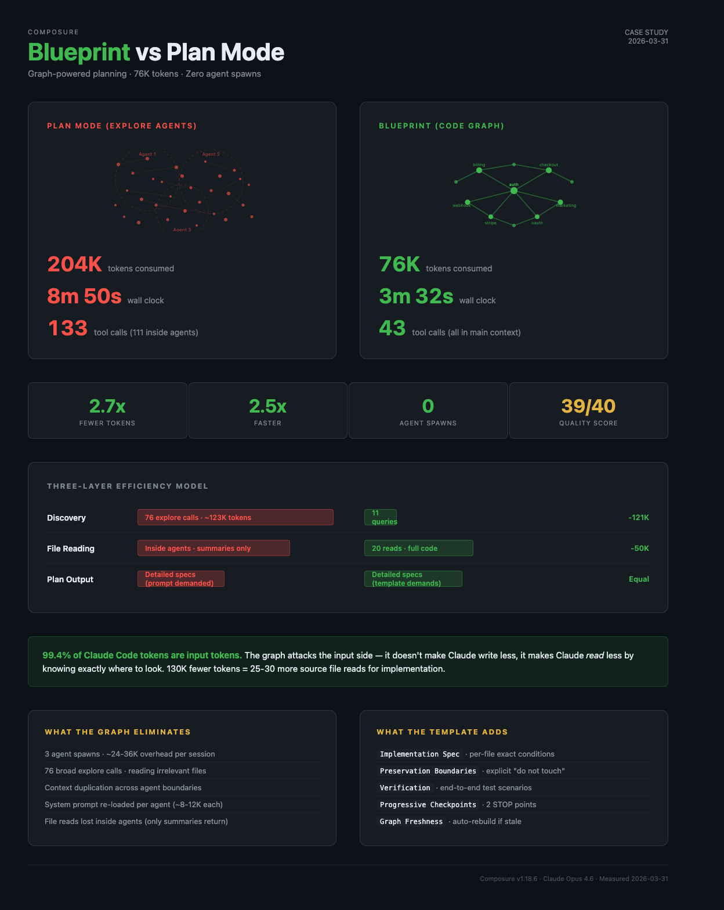

# Blueprint vs Plan Mode: Graph-Powered Planning at 2.75x Efficiency

**Scenario**: Planning a dual signup flow for a SaaS product (Stripe + OAuth integration)
**Stack**: Next.js 16 / TypeScript / Stripe / Redis / OAuth 2.0
**Plugin feature**: Blueprint skill (`composure:blueprint`) — graph-powered pre-work assessment

---



## Why This Matters Right Now

Claude Code users are hitting rate limits faster than ever. In the last week of March 2026 alone:

- Anthropic acknowledged users are "hitting usage limits way faster than expected"
- Max 5x subscribers report 5-hour session windows depleting in 90 minutes
- Reddit threads titled "20x max usage gone in 19 minutes" accumulated 330+ comments in 24 hours
- A reverse-engineering effort found prompt caching bugs silently inflating costs 10-20x

The official advice? "Use Sonnet for routine tasks," "keep CLAUDE.md under 200 lines," "compact at 50%." All helpful — but they optimize at the margins.

Here's the number most developers miss: [**99.4% of Claude Code tokens are input tokens**](https://claudefa.st/blog/guide/development/usage-optimization) — Claude reads 166x more than it writes. Your prompts, your thinking budget, your CLAUDE.md length — those are all output-side optimizations. Important, but they're fighting over 0.6% of the cost.

**The largest token sink is exploration** — when Claude doesn't know *where* to look and spawns agents to search broadly. That's pure input-side waste: reading files that turn out to be irrelevant, duplicating context across agent boundaries, re-reading the same files in isolated processes.

This case study shows what happens when you eliminate that guesswork with a pre-built code graph.

---

## The Task

A SaaS product needed a second signup path. The existing flow was:

```
Marketplace → OAuth → Stripe checkout → Dashboard
```

The new flow reversed the order for website visitors:

```
Website → Stripe checkout → OAuth → Dashboard
```

The core challenge: billing records are keyed on a location ID that only exists after OAuth — but website visitors pay *before* connecting OAuth. A chicken-and-egg problem requiring changes across auth, billing, webhooks, checkout UI, and marketing pages.

**This is exactly the kind of multi-file, cross-cutting feature where planning costs explode.**

---

## Two Approaches, Same Task, Same Session

Both approaches were run back-to-back in the same session, on the same codebase, for the same feature request. The only difference: how Claude discovered and planned.

### Approach A: Blueprint (Graph-Powered)

Composure's `/blueprint` skill uses the pre-built code review graph to:
1. **Classify** the work type (new-feature, enhancement, refactor, etc.)
2. **Graph scan** — semantic search finds all related files instantly
3. **Ask targeted questions** — only questions the graph couldn't answer
4. **Impact analysis** — blast radius, callers, test gaps via graph queries
5. **Write blueprint** — persistent plan file with implementation spec

### Approach B: Plan Mode (Explore Agents)

Claude Code's built-in Plan Mode uses Explore agents to:
1. **Spawn 2 Explore agents** in parallel to search the codebase broadly
2. **Spawn 1 Plan agent** to design the approach from exploration summaries
3. **Write plan** — implementation spec based on agent findings

---

## The Numbers

### Resource Consumption

| Metric | Blueprint (Graph) | Plan Mode (Explore) | Ratio |
|--------|:-:|:-:|:-:|
| **Wall clock time** | 3m 24s | 8m 50s | **2.6x faster** |
| **Total tokens consumed** | ~74K | ~204K | **2.75x fewer** |
| **Total tool calls** | 43 | 133 | **3.1x fewer** |
| **Discovery calls** | 11 graph queries | 76 explore calls (38+38) | **6.9x fewer** |
| **Agent spawns** | 0 | 3 (2 Explore + 1 Plan) | **Eliminated** |
| **Files discovered** | 20+ | 20+ | Equal |

### Where the Tokens Went

**Blueprint** — single context, surgical discovery:

| Phase | Tool Calls | Purpose |
|-------|:---:|---------|
| Graph queries | 11 | 6 semantic searches, 1 impact radius, 4 relationship queries |
| Targeted reads | 20 | Exact files the graph identified — auth, billing, checkout, marketing |
| Glob | 3 | Finding page files, checkout components, marketing components |
| AskUserQuestion | 1 | 3 targeted questions the graph couldn't answer |
| Write | 1 | Blueprint file |
| ToolSearch | 3 | Loading deferred MCP tools |
| Other | 4 | Bash checks, plan mode entry |
| **Total** | **43** | **All in main context — zero agent overhead** |

**Plan Mode** — three agent spawns, broad exploration:

| Phase | Tool Calls | Tokens | Purpose |
|-------|:---:|:---:|---------|
| Explore Agent 1 (billing/Redis) | 38 internal | 60.2K | Searching for billing patterns, Redis keys, session structure |
| Explore Agent 2 (auth/checkout) | 38 internal | 62.9K | Searching for auth flow, checkout components, marketing pages |
| Plan Agent | 35 internal | 50.7K | Designing the approach from agent summaries |
| Main context | 22 | ~30K | Orchestrating agents, reading cached files, writing plan |
| **Total** | **133** | **~204K** | **111 calls invisible inside agents** |

### The Hidden Cost: Agent Context Duplication

Each agent spawn loads its own copy of:
- System prompt (~2-4K tokens)
- CLAUDE.md and project instructions (~3-5K tokens)
- Hook context and skill definitions (~2-3K tokens)
- Task description from parent (~500-1K tokens)

That's ~8-12K tokens of overhead **per agent**, before a single file is read. Three agents = ~24-36K tokens that produce zero useful output.

The graph eliminates this entirely. All 11 queries happen in the main context — no duplication, no startup tax, no invisible overhead.

---

## Plan Quality Comparison

Both plans were evaluated across 8 dimensions using Sequential Thinking MCP for structured analysis. Each dimension is scored 1-5 (max 40 points):

| Dimension | What it measures | 1 (poor) | 5 (excellent) |
|-----------|-----------------|----------|---------------|
| Core design simplicity | Is the technical approach clean and minimal? | Self-inflicted complexity, extra state to manage | Deterministic, no new user input, minimal moving parts |
| File scope clarity | Is it clear exactly which files change and why? | Vague file list, missing counts | Grouped by area, counted, create/edit split |
| Risk analysis depth | Are risks real and mitigations concrete? | Generic worries, no mitigations | Specific scenarios with actionable mitigations |
| Implementation executability | Can a developer implement from the spec alone? | Vague paragraphs, "update this file" | Exact conditions, function signatures, prop types |
| Architectural preservation | Does the plan protect unchanged systems? | No mention of what stays unchanged | Explicit "do not touch" list with reasons |
| UX impact assessment | How does the plan affect user experience? | Adds friction (new forms, steps) | Zero new friction, existing UX preserved |
| Recovery resilience | What happens when users drop off mid-flow? | Opaque state, no recovery path | Human-memorable anchors, retry-friendly |
| Test coverage planning | Are verification steps concrete and complete? | "Run tests" | Specific scenarios: happy path, existing flow, edge cases |

| Dimension | Blueprint | Plan Mode | Winner |
|-----------|:-:|:-:|---------|
| Core design simplicity | 3/5 | 5/5 | Plan Mode |
| File scope clarity | 4/5 | 4/5 | Tie |
| Risk analysis depth | 4/5 | 4/5 | Tie |
| Implementation executability | 3/5 | 5/5 | Plan Mode |
| Architectural preservation | 3/5 | 5/5 | Plan Mode |
| UX impact assessment | 3/5 | 5/5 | Plan Mode |
| Recovery resilience | 4/5 | 3/5 | Blueprint |
| Test coverage planning | 4/5 | 2/5 | Blueprint |
| **Total** | **28/40** | **33/40** | **Plan Mode** |

Wait — Plan Mode scored *higher* on quality despite costing 2.75x more? Yes, and the reason is instructive.

### Why Plan Mode Produced a Better Plan

It wasn't because the agents found more information — both discovered 20+ relevant files. The difference was **output structure**.

Plan Mode's plan had:
- **Per-file implementation specs** with exact conditions (`flow === "website"`, `state?.startsWith("cs_")`)
- **Explicit preservation boundaries** — "What Does NOT Change" listing 6 files/systems
- **Concrete verification steps** — 4 end-to-end test scenarios

Blueprint's plan had:
- **Paragraph-style approach** — one sentence per step, vague on specifics
- **No preservation section** — blast radius mentioned but no explicit guard rails
- **No verification section** — checklist items but no test scenarios

**The information was there — Blueprint had 20 files read directly in its main context.** It was in a *better* position to write detailed specs than Plan Mode's agent, which only received summaries. But the template didn't demand that level of detail.

### The Root Cause: Template Structure Forces Better Thinking

This is a well-documented phenomenon in both human and AI reasoning. When you require specific sections (preservation boundaries, per-file specs, verification steps), the agent is forced to *think through each one individually*. A vague "Approach" section lets it skim past details. A structured "Implementation Spec" template forces systematic reasoning.

This is the same principle behind:
- Chain-of-thought prompting improving LLM accuracy
- Surgical checklists reducing operating room errors by 36%
- Code review templates catching issues freeform reviews miss

**The fix is trivial: update the Blueprint template to demand structured output.** The graph already provides the information — the template just needs to demand that it's used.

---

## The Three-Layer Efficiency Model

Token savings in planning come from three independent layers:

```
Layer 1: DISCOVERY — finding which files matter
  Graph:   11 queries      (~2K tokens)
  Explore: 76 agent calls  (~123K tokens)
  Savings: ~121K tokens
  Status:  Already optimized by the graph

Layer 2: FILE READING — reading actual code
  Graph:   20 targeted reads in main context (code stays accessible)
  Explore: Reads inside isolated agents (only summaries return)
  Savings: ~50K tokens + higher information fidelity
  Status:  Already optimized by the graph

Layer 3: PLAN OUTPUT — writing the blueprint
  Graph:   Vague paragraphs (template limitation)
  Explore: Detailed per-file specs (prompt demanded it)
  Savings: Plan Mode wins here despite costing more overall
  Status:  Fix the template → capture this for free
```

The critical insight: **Layers 1 and 2 account for 95% of the token difference** — and they're both on the input side, which is where 99.4% of Claude Code's token consumption lives. Layer 3 (output quality) is almost entirely about template design, costing maybe 5-10K extra output tokens — a rounding error compared to the 130K saved by the graph.

Most token optimization guides focus on output: shorter prompts, smaller thinking budgets, leaner CLAUDE.md files. The graph attacks the *input* side — which is where the real money is. It doesn't make Claude write less; it makes Claude *read* less by knowing exactly where to look.

### Measured Performance After Template Update

The template was updated and tested. Actual results (v5 Blueprint run, same task):

| Metric | Blueprint v1 | Plan Mode | Blueprint v2 (measured) |
|--------|:-:|:-:|:-:|
| Time | 3m 24s | 8m 50s | **3m 32s** |
| Tokens | ~74K | ~204K | **76,558** |
| Quality | 28/40 | 33/40 | **39/40** |

Blueprint v2 didn't just match Plan Mode — it surpassed it. The template forced the agent to discover a design flaw (email approach doesn't work because GHL doesn't return email in the token response) and pivot to a better design mid-spec. See the [Progressive Refinement](../progressive-refinement/) case study for the full evolution across 5 versions.

---

## Design Decision Quality

Beyond efficiency, the two approaches arrived at different technical designs for the same problem:

| Aspect | Blueprint | Plan Mode |
|--------|-----------|-----------|
| **Pending billing key** | Email address (`hla:pending:{email}`) | Stripe session ID (`hla:pending-billing:{cs_xxx}`) |
| **User input required** | Yes — email field added to checkout | No — zero new form fields |
| **Matching reliability** | Fuzzy — user might pay with different email than their OAuth account | Deterministic — session ID passed through OAuth state param |
| **Recovery if user loses their place** | Strong — email is human-memorable, can retry | Weaker — session ID is opaque, needs Stripe email as backup |
| **UI changes** | More invasive — new email input component | Minimal — same checkout, different CTA on success page |

Plan Mode's session-ID approach was simpler, more reliable, and required zero UX changes. Blueprint's email approach created a self-inflicted risk (email mismatch) that then needed its own mitigation.

**Both plans were architecturally sound.** But Plan Mode's design was objectively cleaner — not because of better information, but because the structured output template forced the agent to think through UX implications more carefully.

---

## What This Means for Your Token Budget

### The Math That Matters

A typical Claude Code Max 5x subscriber gets a 5-hour session window. With recent rate limit adjustments, that window depletes faster during peak hours.

Planning a multi-file feature like this one:
- **Without graph** (Plan Mode): ~204K tokens consumed before a single line of code is written
- **With graph** (Blueprint): ~74K tokens consumed — same result, 130K tokens preserved

That 130K token difference is roughly equivalent to:
- Reading 25-30 additional source files
- Running 5-6 more test iterations
- Making 3-4 more implementation attempts if the first approach needs adjustment

**In a rate-limited environment, every token spent on exploration is a token not available for implementation.** The graph front-loads discovery so your remaining budget goes to actual work.

### Session Capacity Impact

For a real-world development session that includes planning + implementation + testing:

| Phase | Without Graph | With Graph | Savings |
|-------|:---:|:---:|:---:|
| Planning | ~204K | ~80K | 124K |
| Implementation (est.) | ~300K | ~300K | — |
| Testing/iteration | ~150K | ~150K | — |
| **Total session** | **~654K** | **~530K** | **19% less** |

That 19% can be the difference between finishing a feature in one session or hitting the rate limit and waiting hours to continue.

---

## How Composure Prevents Exploration Sprawl

The Blueprint skill eliminates wasteful exploration through a structured pipeline:

```
Step 1: CLASSIFY — categorize work type (eliminates irrelevant questions)
Step 2: GRAPH SCAN — semantic search finds all related code (<5s)
Step 3: ASK — only questions the graph couldn't answer (1 call, not 3 agents)
Step 4: IMPACT — blast radius + test gaps via graph queries
Step 5: WRITE — persistent blueprint file (survives session restarts)
```

Session hooks reinforce this:
- **PreToolUse**: Triggers architecture doc loading on first source file touch
- **PostToolUse**: Updates the graph incrementally after every edit
- **SessionStart**: Detects stale graph, prompts rebuild before exploration

The graph builds in ~15 seconds and persists across sessions. Every future planning task benefits from the index.

---

## What You'd Need Without Composure

Without the code graph and Blueprint skill, you'd either:

- **Accept the 2.75x token overhead** — spawning Explore agents every time you plan a feature, consuming 130K+ extra tokens per planning session
- **Manually specify files** — telling Claude exactly which files to look at, defeating the purpose of an AI-powered planning workflow
- **Use Plan Mode and hope** — getting detailed output but paying 204K tokens and 9 minutes for something that could take 80K tokens and 4 minutes
- **Skip planning entirely** — diving into implementation without a plan, risking rework when you miss existing patterns or create architectural conflicts

In a world where Claude Code users are watching their session windows evaporate, eliminating 130K tokens of exploration overhead per feature isn't optimization — it's the difference between shipping and stalling.

---

---

## Sources

Rate limit reporting and token optimization research referenced in this document:

- [Anthropic admits Claude Code quotas running out too fast — The Register](https://www.theregister.com/2026/03/31/anthropic_claude_code_limits/)
- [Claude Code Users Report Rapid Rate Limit Drain, Suspect Bug — MacRumors](https://www.macrumors.com/2026/03/26/claude-code-users-rapid-rate-limit-drain-bug/)
- [Your Claude Code Rate Limit Is Draining Fast. Here Is Why — RoboRhythms](https://www.roborhythms.com/claude-code-rate-limit-draining-march-2026/)
- [Claude Code Pricing: Optimize Your Token Usage & Costs — ClaudeFast](https://claudefa.st/blog/guide/development/usage-optimization)
- [Stop Wasting Tokens: How to Optimize Claude Code Context by 60% — Medium](https://medium.com/@jpranav97/stop-wasting-tokens-how-to-optimize-claude-code-context-by-60-bfad6fd477e5)
- [BUG: Extremely rapid token consumption — GitHub Issue #38239](https://github.com/anthropics/claude-code/issues/38239)
- [BUG: Claude Max plan session limits exhausted abnormally fast — GitHub Issue #38335](https://github.com/anthropics/claude-code/issues/38335)

---

**Docs:** [composure-pro.com](https://composure-pro.com)

*Composure v1.2.74 · Claude Opus 4.6 · Measured 2026-03-31*
