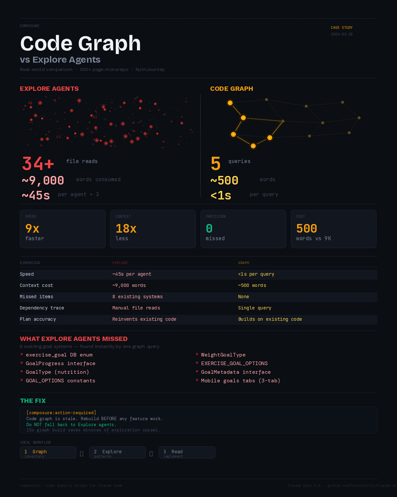

# Code Graph vs Explore Agents

**Scenario**: Building a new feature in a large monorepo
**Stack**: Monorepo (web + mobile + shared packages), 500+ pages, 70+ database migrations
**Plugin feature**: Code review graph (`composure-graph` MCP server)

---

## The Problem

When Claude Code needs to understand a large codebase before building a feature, it defaults to spawning Explore agents — sub-agents that read files broadly across the repo to map out what exists.

This works, but it's expensive:
- Each agent reads dozens of files
- The output fills context with thousands of words
- Broad exploration misses specific things that a targeted search would catch
- Multiple agents can overlap, reading the same files

In a 500+ page monorepo with shared packages, this exploration can consume the majority of your context window before any code is written.

---

## What Happened

**Task**: Build a goal tracking system that integrates with existing nutrition, fitness, and body composition data.

**Critical requirement**: Find all existing goal-related code (enums, types, constants, hooks, UI) before planning — to build on what exists, not reinvent it.

### Without the Graph

Three parallel Explore agents searched the codebase:

| Agent | Focus | Time | Context Cost |
|-------|-------|------|-------------|
| Agent 1 | Database schema & patterns | ~45s | ~3,000 words |
| Agent 2 | Route structure & components | ~45s | ~3,500 words |
| Agent 3 | Shared types & constants | ~45s | ~2,500 words |

**Result**: ~9,000 words consumed. 34+ file reads. Still **missed 8 existing goal-related systems** — enums, types, constants, and UI components that already existed in the codebase.

The resulting plan would have reinvented code that was already there.

### With the Graph

Five targeted graph queries:

| Query | Time | Result |
|-------|------|--------|
| `semantic_search("goal")` | <1s | 30 nodes — every goal-related file, function, and type |
| `semantic_search("assignment")` | <1s | 20 nodes — all related assignment code |
| `file_summary(key-factory.ts)` | <1s | 6 nodes — all exports with exact line numbers |
| `importers_of(config.ts)` | <1s | Precise dependency chain |
| `imports_of(types.ts)` | <1s | Confirmed shared package dependency |

**Result**: ~500 words of structured output. 5 queries, each under 1 second. Found everything the Explore agents found **plus** the 8 systems they missed.

---

## Head-to-Head

| Dimension | Explore Agents | Code Graph |
|-----------|---------------|------------|
| **Speed** | ~45s per agent (parallel) | <1s per query |
| **Context cost** | ~9,000 words | ~500 words |
| **Missed items** | 8 existing systems | None |
| **Dependency tracing** | Manual (read imports by hand) | Single query |
| **Plan accuracy** | Would reinvent existing code | Builds on existing code |

---

## The Impact

| Metric | Without Graph | With Graph | Improvement |
|--------|--------------|------------|-------------|
| Discovery time | ~45 seconds | <5 seconds | **9x faster** |
| Context consumed | ~9,000 words | ~500 words | **18x less** |
| Completeness | Missed 8 systems | Found all | **No blind spots** |
| Plan accuracy | Would reinvent existing code | Correct from the start | **Zero rework** |

---

## How Composure Prevents This

Session hooks now detect when the graph is stale and instruct Claude to rebuild before exploring:

```
[composure:action-required] Code graph is stale or missing.
BEFORE any feature work, rebuild using build_or_update_graph.
Do NOT fall back to Explore agents.
The 15-second graph build saves minutes of exploration sprawl.
```

**Ideal workflow**:
1. **Graph first** — inventory and relationship mapping (<5s)
2. **Explore agents** — only for understanding patterns and conventions
3. **Read specific files** — implementation details for the files the graph identified

---

## What You'd Need Without Composure

Without the code graph, you'd either:
- Accept the 9,000-word context burn on every major task
- Manually tell Claude which files to look at (defeating the purpose of an AI assistant)
- Hope that broad exploration catches everything (it won't)

The graph builds in ~15 seconds and persists across sessions. It's updated incrementally after every edit via PostToolUse hooks. Once built, every future task benefits.

---

*Composure v1.2.74 · Claude Opus 4.6*


