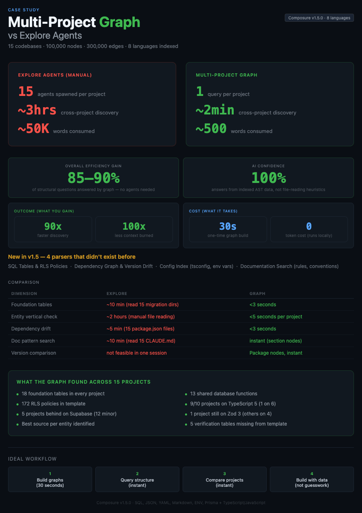

# Multi-Project Graph — Cross-Codebase Intelligence at Scale

**Scenario**: Analyzing 15 projects from a parent directory to build a starter template
**Scale**: 15 codebases, ~100,000 nodes, 300,000+ edges, 8 indexed languages
**Plugin feature**: Multi-language graph parsers (v1.5.0) + cross-project `repo_root` queries

---

## The Problem

When you manage multiple projects — SaaS products, client work, templates — questions span codebases:

- "Which of my projects has the best contact management implementation?"
- "Are all my apps on the same Next.js version?"
- "What tables are in every project vs unique to one?"
- "If I build a starter template, what's the foundation that every app needs?"

Without structural intelligence, answering these requires opening each project, reading files, taking notes, and manually comparing. With 15 projects, that's hours of context-switching.

---

## What Happened

**Task**: Build a monorepo starter template by analyzing 15 production projects to find the common foundation — database tables, UI patterns, and dependencies that every project shares.

### Step 1: Build Graphs for All Projects (2 minutes)

From `~/Projects` (the parent directory), built graphs for all 15 child projects in parallel:

```
build_or_update_graph({ repo_root: "~/Projects/project-a", full_rebuild: true })
build_or_update_graph({ repo_root: "~/Projects/project-b", full_rebuild: true })
...13 more in parallel
```

| Project | Files Parsed | Nodes | Edges |
|---------|-------------|-------|-------|
| Project A (SaaS) | 3,505 | 38,287 | 93,586 |
| Project B (CRM) | 2,756 | 17,249 | 67,154 |
| Project C (Health) | 2,924 | 16,864 | 72,091 |
| Project D (Delivery) | 3,603 | 49,780 | 106,342 |
| Project E (MDM) | 745 | 6,123 | 16,982 |
| ...10 more | ... | ... | ... |
| **Total** | **~12,000** | **~100,000** | **~300,000** |

Time: ~30 seconds for all 15 graphs (parallel MCP calls).

### Step 2: Foundation Table Analysis (instant)

Queried each project's SQL nodes to find tables present in ALL production projects:

```
For each project:
  SELECT name FROM nodes WHERE kind = 'Table'
→ Intersect across all projects
→ 18 foundation tables found in every project
→ 0 missing from the template
```

**Result**: The template's database was already complete — 18 tables, 13 functions, all matching production. The 5 verification tables (passkeys, TOTP) were the only gap — present in 2 of 3 projects.

### Step 3: Entity Vertical Analysis — "Carpet Matches Drapes" (instant)

For each foundation entity (contacts, accounts, users, devices, etc.), queried the full vertical across all projects:

| Entity | Best Project | Tables | Hooks | Components | Pages | Forms |
|--------|-------------|--------|-------|------------|-------|-------|
| Account | Project B | 62 cols | 48 | 132 | 35 | 39 |
| Contact | Project B | 27 cols | 24 | 158 | 29 | 16 |
| Device | Project E | 73 cols | 26 | 54 | 18 | 9 |
| Auth | Project D | 52 cols | 16 | 94 | 16 | 19 |
| Inbox | Project C | 50 cols | 7 | 24 | 11 | 4 |

This instantly told us which project to copy each feature from — the one with the most complete DB-to-UI implementation.

### Step 4: Dependency Version Drift (instant)

Queried Package nodes across all projects:

```
For each project:
  SELECT name, return_type FROM nodes WHERE kind = 'Package' AND name = 'next'
```

| Package | Project A | Project B | Project C | Project D | Project E | Latest |
|---------|-----------|-----------|-----------|-----------|-----------|--------|
| Next.js | ^16.1.6 | 16.1.1 | 16.1.1 | ^16.1.6 | 16.1.1 | 16.2.1 |
| TypeScript | ^5.9.3 | ^5.7.3 | ^5.7.3 | ^5.9.3 | ^5.7.3 | 6.0.2 |
| Supabase | ^2.93.3 | ^2.89.0 | ^2.89.0 | — | ^2.89.0 | 2.101.0 |

Found: 9 of 10 projects still on TypeScript 5 (only one on 6). Supabase JS 12 minor versions behind in 5 projects. One project still on Zod 3 while all others moved to Zod 4.

---

## What This Would Take Without the Graph

| Task | With Graph | Without Graph (Explore Agents) |
|------|-----------|-------------------------------|
| Build 15 project graphs | 30 seconds | N/A (no structural index) |
| Find foundation tables | 1 query per project, ~3s total | 15 Explore agents reading migrations, ~10 min |
| Entity vertical analysis | `entity_scope` per project, ~5s | Manual file reading across 15 projects, ~2 hours |
| Dependency comparison | Package nodes queried, ~3s | Read 15 package.json files manually, ~5 min |
| CLAUDE.md pattern search | Markdown section nodes, instant | Read 15 CLAUDE.md files, ~10 min |
| **Total discovery time** | **~2 minutes** | **~3 hours** |

---

## Token Economics

At multi-project scale, Explore agent overhead multiplies per project. Each agent re-loads its own system prompt, CLAUDE.md, and hooks — then does internal grep/read cycles that are all billed but invisible to the parent context.

### Without Graph — Explore Agent Cost

| Task | Agents needed | Tokens per agent | Total tokens |
|------|--------------|-----------------|-------------|
| Foundation tables | 15 (1 per project, reading migrations) | ~20,000 | ~300,000 |
| Entity vertical (5 entities) | 75 (5 per project) | ~20,000 | ~1,500,000 |
| Dependency comparison | 15 (1 per project) | ~15,000 | ~225,000 |
| CLAUDE.md patterns | 15 (1 per project) | ~10,000 | ~150,000 |
| **Total** | **120 agents** | | **~2,175,000** |

This exceeds any single context window. Reality: you'd need **5-10 sessions**, each with its own startup overhead, losing cross-project context between them.

### With Graph — MCP Query Cost

| Task | Queries needed | Tokens per query | Total tokens |
|------|---------------|-----------------|-------------|
| Build 15 graphs | 15 `build_or_update_graph` calls | ~200 | ~3,000 |
| Foundation tables | 15 `query_graph` (table nodes) | ~400 | ~6,000 |
| Entity vertical (5 entities) | 75 `entity_scope` calls | ~500 | ~37,500 |
| Dependency comparison | 15 `query_graph` (package nodes) | ~400 | ~6,000 |
| CLAUDE.md patterns | 15 `semantic_search` calls | ~400 | ~6,000 |
| **Total** | **135 queries** | | **~58,500** |

All in a **single session**, with all results in main context for cross-project comparison.

### True Ratio

| Metric | Explore Agents | Graph Queries | Ratio |
|--------|---------------|---------------|-------|
| **Total tokens consumed** | ~2,175,000 | ~58,500 | **37x** |
| **Sessions required** | 5-10 | 1 | **5-10x** |
| **Cross-project context** | Lost between sessions | Retained in one session | **∞** |
| **Invisible overhead** | ~1,800,000 (agent internals) | 0 | **Eliminated** |
| **Wall clock** | ~3 hours | ~2 minutes | **90x** |

**Why multi-project makes the gap exponential:** At single-project scale, the graph saves 30x (60k → 2k tokens). At multi-project scale, it's 37x (2.1M → 58k) — but the real cost isn't the ratio. It's that 2.1M tokens can't fit in one session. Explore agents force 5-10 context restarts, losing cross-project comparisons between each. The graph keeps everything in one session, which is what makes cross-project intersection queries (foundation tables, entity verticals, version drift) possible at all.

---

## Head-to-Head: Single-Project vs Multi-Project

| Dimension | Single-Project (v1.2) | Multi-Project (v1.5) |
|-----------|----------------------|---------------------|
| Languages indexed | 4 (JS/TS) | 8 (+SQL, JSON, YAML, Markdown, ENV, Prisma) |
| Node kinds | 5 | 13 (+Table, Column, RLSPolicy, Index, Package, Script, Workspace, ...) |
| Edge kinds | 7 | 10 (+REFERENCES, SECURES, INDEXES) |
| Scope | Single repo | Any repo via `repo_root` parameter |
| SQL understanding | Entity detection via regex | Full AST: tables, columns, policies, indexes, FK refs, triggers |
| Dependency awareness | None | Package graph with version tracking, framework detection |
| Config awareness | None | tsconfig paths, env vars, next.config flags |
| Documentation awareness | None | Content-level section indexing, rule/convention classification |
| Audit intelligence | File size only | Cohesion analysis + recommendations (split/monitor/ignore) |

---

## The Impact

| Metric | Without Multi-Project Graph | With Multi-Project Graph | Improvement |
|--------|---------------------------|-------------------------|-------------|
| Cross-project discovery | ~3 hours (manual) | ~2 minutes | **90x faster** |
| Total tokens consumed | ~2,175,000 (across 5-10 sessions) | ~58,500 (single session) | **37x fewer** |
| Invisible overhead | ~1,800,000 (agent internals) | 0 | **Eliminated** |
| Sessions required | 5-10 (context limit forces restarts) | 1 | **Single session** |
| Foundation analysis | Not feasible in one session | Instant intersection queries | **New capability** |
| Version drift detection | Manual package.json comparison | Automated Package node comparison | **New capability** |
| Entity completeness check | Days of manual file reading | `entity_scope` per project | **New capability** |
| Template gap analysis | Guesswork | Data-driven (graph intersection) | **New capability** |
| Total nodes indexed | ~50,000 (JS/TS only) | ~100,000 (8 languages) | **2x coverage** |

---

## What Changed in v1.5.0

Four new parsers, all regex-based (no tree-sitter dependency):

1. **SQL parser** — `CREATE TABLE`, columns, RLS policies, indexes, foreign keys, triggers, database functions. Supports Supabase migrations + Prisma schemas.
2. **Package parser** — `package.json` dependencies (prod/dev/peer), scripts, workspaces. Also `turbo.json` tasks and `pnpm-workspace.yaml`.
3. **Config parser** — `tsconfig.json` (paths, strict mode), `next.config.*` (experimental flags), `tailwind.config.*` (plugins), `.env.example` (variable names + categories, never values).
4. **Markdown parser** — Content-level section indexing with classification (rule, convention, decision, reference, setup). Extracts file references from documentation.

Plus:
- **Cohesion audit** — detects "grab bag" files (many functions, no internal calls), mixed concerns, inline candidates
- **Recommendation engine** — each finding says "split", "split-on-next-touch", "monitor", or "ignore" with a reason

The graph runs silently. Claude uses it automatically. No configuration beyond `/composure:initialize`.

---

*Composure v1.5.0 · Claude Opus 4.6 (1M context) · Updated 2026-03-30*


