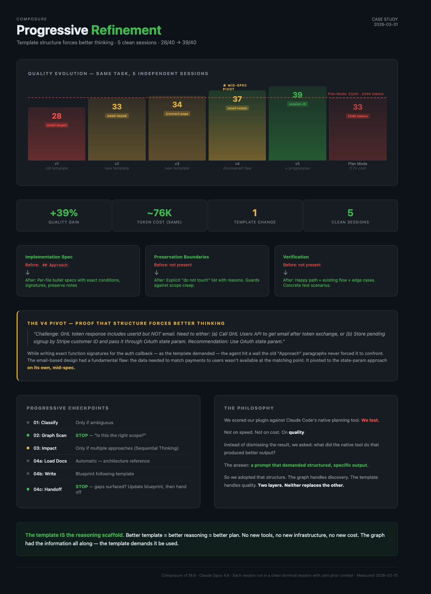

# Closing the Quality Gap: How Native Plan Mode Made Blueprint Better

**Scenario**: Plugin development — improving planning output quality without sacrificing efficiency
**What happened**: Blueprint scored lower than Claude Code's native Plan Mode on plan quality, despite being 2.75x faster and cheaper. One template change closed the gap.
**Plugin feature**: Blueprint skill (`composure:blueprint`) — template-driven planning with progressive refinement

---



## The Hook

We scored our plugin against Claude Code's native planning tool. We lost.

Not on speed — Blueprint was 2.6x faster. Not on cost — Blueprint used 2.75x fewer tokens. We lost on **quality**. The plan that Plan Mode produced was more detailed, more executable, and had better architectural guard rails.

Then we figured out why. And the fix took 30 minutes.

---

## The Experiment

A SaaS product needed a dual signup flow — two entry paths (marketplace install and website checkout) converging on the same dashboard. A multi-file feature touching auth, billing, webhooks, checkout UI, and marketing pages.

We ran both approaches back-to-back, same session, same codebase, same task:

**Blueprint** (graph-powered, Composure plugin): 11 graph queries found all related files, 20 targeted reads, 1 round of user questions. Produced a blueprint in 3 minutes 24 seconds using ~74K tokens.

**Plan Mode** (native Claude Code): 2 Explore agents + 1 Plan agent searched the codebase broadly. Produced a plan in 8 minutes 50 seconds using ~204K tokens.

Both discovered the same 20+ files. Both mapped the same two flows. Both identified risks and edge cases.

---

## The Scores

We evaluated both plans across 8 dimensions using Sequential Thinking MCP for structured analysis. Each dimension is scored 1-5 (max 40 points):

| Dimension | What it measures | 1 (poor) | 5 (excellent) |
|-----------|-----------------|----------|---------------|
| Core design simplicity | Is the technical approach clean and minimal? | Self-inflicted complexity, extra state to manage | Deterministic, no new user input, minimal moving parts |
| File scope clarity | Is it clear exactly which files change and why? | Vague file list, missing counts | Grouped by area, counted, create/edit split |
| Risk analysis depth | Are risks real and mitigations concrete? | Generic worries, no mitigations | Specific scenarios with actionable mitigations |
| Implementation executability | Can a developer implement from the spec alone? | Vague paragraphs, "update this file" | Exact conditions, function signatures, prop types |
| Architectural preservation | Does the plan protect unchanged systems? | No mention of what stays unchanged | Explicit "do not touch" list with reasons |
| UX impact assessment | How does the plan affect user experience? | Adds friction (new forms, steps) | Zero new friction, existing UX preserved |
| Recovery resilience | What happens when users drop off mid-flow? | Opaque state, no recovery path | Human-memorable anchors, retry-friendly |
| Test coverage planning | Are verification steps concrete and complete? | "Run tests" | Specific scenarios: happy path, existing flow, edge cases |

| Dimension | Blueprint | Plan Mode |
|-----------|:-:|:-:|
| Core design simplicity | 3/5 | 5/5 |
| File scope clarity | 4/5 | 4/5 |
| Risk analysis depth | 4/5 | 4/5 |
| Implementation executability | 3/5 | 5/5 |
| Architectural preservation | 3/5 | 5/5 |
| UX impact assessment | 3/5 | 5/5 |
| Recovery resilience | 4/5 | 3/5 |
| Test coverage planning | 4/5 | 2/5 |
| **Total** | **28/40** | **33/40** |

Blueprint won on recovery analysis and test planning. Plan Mode won on everything else that matters for implementation.

---

## The Diagnosis

The quality gap wasn't about information. Blueprint had **more** information — it read 20 files directly in its main context window. Plan Mode's agents read files in isolated contexts and only returned summaries. Blueprint was in a better position to write detailed specs.

The gap was about **what the template demanded**.

### Blueprint's old template

```markdown
## Approach
1. {Step 1 -- what to build first and why}
2. {Step 2}
3. {Step 3}

## Risks
- {Risk 1}
- {Risk 2}
```

This produced paragraph descriptions — one vague sentence per file. No exact conditions, no preservation boundaries, no verification steps.

### Plan Mode's prompt

Plan Mode's planning agent received a detailed prompt asking for "per-file changes, exact conditions, what to add/remove." It produced bullet-point specs with conditions like `flow === "website"` and `state?.startsWith("cs_")`. It listed files that must NOT change. It included 4 end-to-end test scenarios.

**Same information. Different output structure. The structure forced better thinking.**

---

## The Insight

This is a well-documented phenomenon in both human and AI reasoning:

- **Chain-of-thought prompting** improves LLM accuracy by forcing step-by-step reasoning
- **Surgical checklists** reduced operating room errors by 36% — not by adding knowledge, but by requiring doctors to verbalize what they already knew
- **Code review templates** catch issues that freeform reviews miss — the template forces reviewers to check specific areas

A vague "Approach" section lets the agent skim past details. A structured "Implementation Spec" section with per-file subsections forces it to reason about each file individually — using the code it already has in context.

**The template IS the reasoning scaffold.** Better template = better reasoning = better plan. No new tools, no new infrastructure, no new cost.

---

## The Fix

One file: `BLUEPRINT-TEMPLATE.md`. Three sections added, one section restructured.

### Added: Implementation Spec (replaces "Approach")

```markdown
## Implementation Spec

### 1. `path/to/first-file.ts` (Create)
- Exports: {what this module exports}
- Key functions: {names, signatures, purpose}
- {Specific logic: conditions, patterns, key names}

### 2. `path/to/second-file.ts` (Edit)
- Add: {what condition/branch/prop to add}
- Change: {what existing code changes and how}
- Preserve: {what must NOT be modified in this file}
```

Per-file bullet specs with exact changes. A developer can implement from this without guessing.

### Added: Preservation Boundaries

```markdown
## Preservation Boundaries

- `lib/auth/session.ts` — session schema unchanged
- `middleware.ts` — dashboard gate unchanged
- Entire marketplace flow — untouched
```

Explicit "do not touch" guard rails. Prevents "while I'm in here" scope creep during implementation.

### Added: Verification

```markdown
## Verification

1. **Happy path**: visit /checkout → pay → connect OAuth → dashboard loads
2. **Existing flow**: marketplace install still works unchanged
3. **Edge case**: pay, close browser, return later → OAuth still works
```

Concrete test scenarios. At least happy path + existing flow preservation.

### Restructured: Risks (now require mitigations)

```markdown
## Risks

- **Email mismatch** — user might pay with different email.
  Mitigation: pass email through OAuth state param.
```

A risk without a mitigation is just a worry. State what you'll do about it.

### Enforcement rules

The template includes 7 non-negotiable rules. The most important:

> **Rule #1**: Implementation Spec is NOT optional. If you cannot write specific conditions and signatures, the graph scan was insufficient — go back and read more code.

This sends the agent back to the graph instead of accepting vague output. The information is there — the template demands it be used.

---

## Beyond the Template: Progressive Refinement

While studying why Plan Mode produced better output, we also noticed a process gap. The old Blueprint ran a 4-step pipeline and dumped a finished document for the user to review cold. Plan Mode's agents built understanding progressively — each agent's output informed the next.

We restructured the Blueprint flow from **pipeline-then-dump** to **progressive checkpoints**:

| Step | What happens | User checkpoint |
|------|-------------|-----------------|
| 01: Classify | Categorize the work | Only if ambiguous |
| 02: Graph scan | Find related files, present findings | **Always** — "Is this the right scope?" |
| 03: Impact | Blast radius, test gaps, approach options | **Only if** multiple viable approaches (uses Sequential Thinking) |
| 04a: Load docs | Architecture reference for the stack | None — automatic |
| 04b: Write | Blueprint following template | None — writing |
| 04c: Handoff | Present summary | **Only if** gaps surfaced during writing |

By step 04, most questions are already resolved through conversation. The user shapes the plan progressively instead of reviewing a finished document they had no input on.

The checkpoint discipline is important: **every checkpoint has an escape hatch.** Step 01 only asks if ambiguous. Step 03 only fires with multiple approaches. Step 04c only asks if gaps surfaced. No forced round-trips on straightforward tasks.

---

## The Cost of Better Output

Does a more detailed template cost more tokens?

The token budget has three layers:

| Layer | What it covers | % of total | Changed? |
|-------|---------------|:---:|:---:|
| Discovery | Graph queries to find files | ~3% | No |
| File reading | Reading source code | ~70% | No |
| Plan output | Writing the blueprint | ~27% | Yes — slightly more |

The old blueprint was ~120 lines. The new template produces ~180-200 lines. That's maybe 5-10K more output tokens — a rounding error against the 130K the graph saves by eliminating exploration agents.

---

## Before and After

### Before (original template)

| Metric | Blueprint | Plan Mode | Winner |
|--------|:-:|:-:|---------|
| Time | 3m 24s | 8m 50s | Blueprint (2.6x) |
| Tokens | ~74K | ~204K | Blueprint (2.75x) |
| Quality | 28/40 | 33/40 | Plan Mode |

Blueprint won on efficiency but lost on quality. Users got fast plans that needed interpretation during implementation.

### After (updated template + progressive refinement)

| Metric | Blueprint v2 | Plan Mode | Winner |
|--------|:-:|:-:|---------|
| Time | 3m 32s | 8m 50s | Blueprint (2.5x) |
| Tokens | 76,558 | ~204K | Blueprint (2.7x) |
| Quality | **39/40** | 33/40 | **Blueprint** |

Blueprint v2 didn't just close the gap — it surpassed Plan Mode on quality while staying within 2,500 tokens of the original.

### The Evolution: 5 Versions, One Template Change

The new template was tested across 4 runs (v2-v5) on the same task. Each run used the same graph, same codebase, same token budget. The only changes were template refinements and the addition of progressive checkpoints:

| Version | Design approach | Score | What changed |
|---------|----------------|:---:|-------------|
| v1 (old template) | Email-keyed | 28/40 | Baseline — vague "Approach" paragraphs |
| v2 (new template) | Email-keyed | 33/40 | Implementation Spec + Preservation + Verification |
| v3 (new template) | Email + /connect page | 34/40 | Dedicated connect page, detailed function signatures |
| v4 (new template) | Email → state-param **mid-spec pivot** | 37/40 | Agent discovered email flaw while writing specs |
| v5 (new template + progressive) | Session-ID (fully committed) | 39/40 | Clean design from start, user-shaped scope |
| Plan Mode | Session-ID | 33/40 | Reference point — 2.7x more expensive |

### The v4 Pivot: Proof That Structure Forces Better Thinking

The most compelling evidence came from v4. While writing the Implementation Spec for the auth callback, the agent encountered a technical wall it had never hit in v1's vague "Approach" paragraphs:

> *"Challenge: GHL token response includes `userId` but NOT email. Need to either: (a) Call GHL Users API to get email after token exchange, or (b) Store pending signup by Stripe customer ID and pass it through OAuth state param. Recommendation: Use OAuth state param."*

The email-based design had a fundamental flaw: the data needed to match payments to users wasn't available at the matching point. Writing exact function signatures for the auth callback — as the template demanded — forced the agent to confront this. It pivoted to the state-param approach **on its own**, mid-spec.

By v5, it committed to session-ID from the start — the same design Plan Mode had arrived at — but with richer risk analysis (webhook race conditions, state param tampering) and more comprehensive verification scenarios.

All five Blueprint runs were independent sessions with zero shared context. The agent had no knowledge of Plan Mode's session-ID design. It arrived at the same architecture — and then surpassed it — purely because the template forced progressively more specific thinking until the email approach broke under its own weight.

---

## The Philosophy

Most plugin ecosystems position themselves as replacements for native tools. "Use our planning instead of theirs." "Our approach is better."

That's not what happened here.

We ran Blueprint against Plan Mode. Plan Mode won on quality. Instead of dismissing the result or adding competing features, we asked: **what did the native tool do that produced better output?**

The answer wasn't "better algorithms" or "more information." It was "a prompt that demanded structured, specific output." So we adopted that structure in our template.

The graph handles what native tools can't do efficiently — discovery. It eliminates 130K tokens of exploration overhead by knowing where code lives. No amount of template improvement in Plan Mode will match that.

The template handles what the graph doesn't do — output quality. It forces the agent to reason through each file, state preservation boundaries, and define verification steps. The graph had the information all along; the template demands it be used.

**Two independent layers. Each does what it's best at. Neither replaces the other.**

```
Native tools: broad exploration, general-purpose planning
   ↕ learn from each other
Plugin tools: indexed discovery, structured output templates
```

When native tools improve, we study what they did and adapt. When our graph finds something native exploration misses, that's the graph's job. The goal isn't to win a competition — it's to give the user the best plan in the least time with the fewest tokens.

---

## What This Means for Plugin Builders

If you're building tools that extend Claude Code (or any AI coding assistant):

1. **Benchmark against native.** Run your tool and the native equivalent on the same task. Score both honestly. The gaps tell you where to improve.

2. **Diagnose before building.** Our quality gap wasn't a missing feature — it was a template that allowed vagueness. The fix was 30 minutes of template work, not a new tool.

3. **Structured output is a reasoning scaffold.** When you require specific sections (preservation boundaries, per-file specs, verification), the AI is forced to think about those things. Vague templates produce vague output — not because the AI lacks information, but because the template doesn't demand it.

4. **Augment, don't replace.** Your plugin should do what native tools can't do efficiently (indexed discovery, persistent state, cross-session context). For everything else, learn from how native tools solve the same problem.

5. **Checkpoints beat pipelines.** Progressive refinement (user shapes the plan through conversation) produces better plans than pipeline-then-dump (AI delivers a finished document for cold review). Each checkpoint is a chance to correct course before effort is wasted.

---

*Composure v1.2.75 · Claude Opus 4.6 · Measured 2026-03-31*
